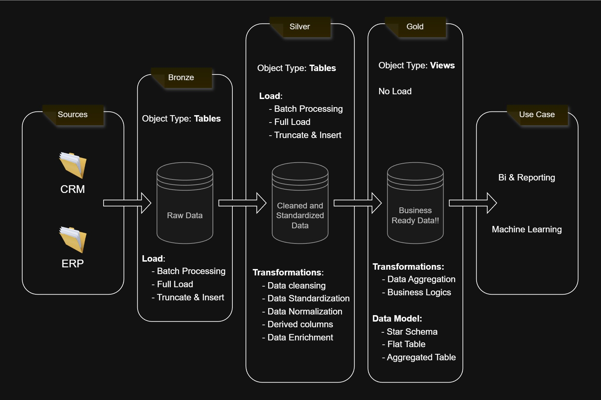
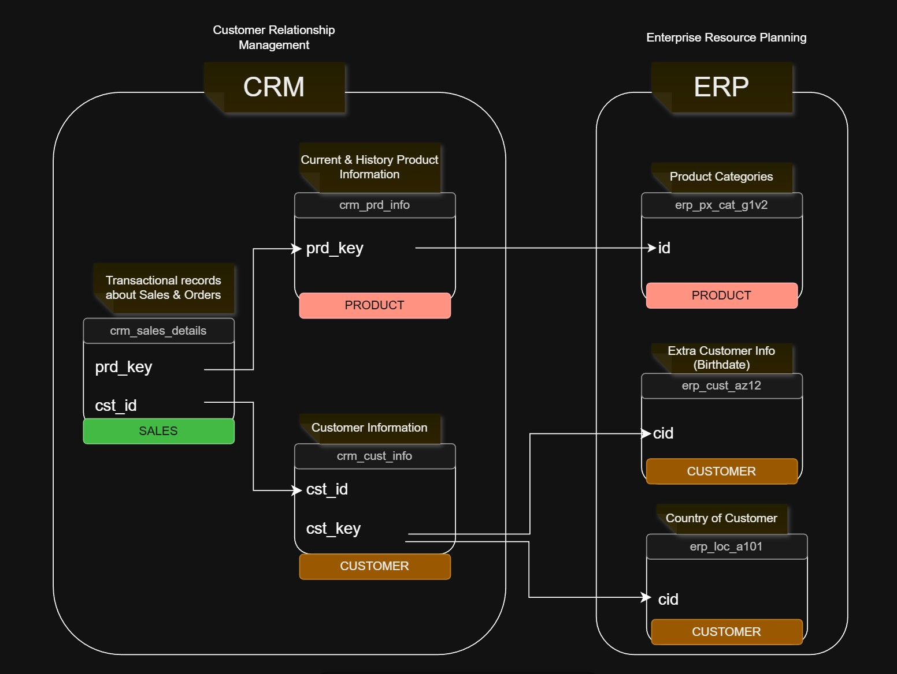

# End-to-End SQL Data Warehouse  
Architected is a comprehensive data engineering project that transforms fragmented ERP and CRM data into a centralized, analytics-ready "Single Source of Truth."   
Utilizing a Medallion Architecture (Bronze → Silver → Gold), the project implements automated ETL pipelines in T-SQL to ensure data integrity, performance, and scalability.

# Project Overview  
The goal of this project is to bridge the gap between raw operational data and actionable business insights.   
By migrating data through three distinct stages, This ensure that the final Star Schema is optimized for complex analytical reporting.  

    - Bronze Layer: Raw data ingestion from CSV sources.
    - Silver Layer: Data cleaning, standardization, and quality enforcement.
    - Gold Layer: Dimensional modeling (Star Schema) for BI consumption.

# Architecture  

# Tech Stack  
**Database Engine:** SQL Server (SSMS)  
**Language:**        T-SQL (Stored Procedures, CTEs, Window Functions)  
**Data Modeling:**   Star Schema (Dimensions & Fact Tables)  
**Workflow:**        ETL Design & Data Profiling  

# Project Structure
├── datasets/  
│  
├── scripts/  
│   ├── bronze/  
│   │   ├── ddl_bronze.sql           # Schema definitions for raw tables  
│   │   └── proc_load_bronze.sql     # Stored procedure for BULK INSERT & logging  
│  
│   ├── silver/  
│   │   ├── ddl_silver.sql           # Schema definitions for cleaned tables  
│   │   ├── proc_load_silver.sql     # Master orchestration script  
│   │   │   
│   │   ├── QualityCheck_Transform_load_crm_cust_info_in_Silver.sql  
│   │   ├── QualityCheck_Transform_load_crm_prd_info_in_Silver.sql  
│   │   ├── QualityCheck_Transform_load_crm_sales_details_in_Silver.sql  
│   │   ├── QualityCheck_Transform_load_erp_cust_az12_in_Silver.sql  
│   │   ├── QualityCheck_Transform_load_erp_loc_a101_in_Silver.sql  
│   │   └── QualityCheck_Transform_load_erp_px_cat_g1v2_in_Silver.sql  
│   │  
│   └── gold/  
│   └──── gold.dim_customers.sql   # Dimension: Unified customer attributes    
│   └──── gold.dim_products.sql    # Dimension: Product catalog and history  
│   └──── gold.fact_sales.sql      # Fact: Key business metrics & transactions  
│    
├── SQL_EDA_DataProfiling/           # Scripts for initial data exploration  
│   └──── 1_database_explore.sql  
│   └──── 2_magnitude_explore.sql  
│   └──── 3_measure_explore.sql  
│   └──── 4_ranking_analysis.sql  
│  
└── diags/                           # Documentation and architectural diagrams  


# ETL Pipeline Details
1. **Bronze Layer (The Landing Zone)**  
The pipeline begins by truncating existing tables and performing a BULK INSERT from source CSV files.  

    - Error Handling: Implemented via TRY...CATCH blocks.  
    - Monitoring: Tracks batch start/end times and individual table load durations for auditability.  

2. **Silver Layer (The Transformation Zone)**  
This layer acts as the quality gate. Each of the 6 scripts performs:  

    - Deduplication: Removing redundant records using ROW_NUMBER().  
    - Standardization: Handling NULL values and formatting dates/strings consistently.  
    - Data Integrity: Validating keys and ensuring business logic consistency before loading into the silver schema.  

3. **Gold Layer (The Presentation Zone)**
The final layer models data into a Star Schema, making it easy for users to query.  

    - dim_customers: Consolidated view of CRM and ERP customer data.  
    - dim_products: Cleaned product hierarchy and pricing.  
    - fact_sales: Centralized sales transactions linked to dimensions.  

# DataFlow and Integeration  

# How to Run:
Clone the Repository:
```Bash
git clone https://github.com/AmanJain2401/Enterprise-SQL-Data-Warehouse-ETL-Pipeline.git
```  
  
**Setup Database:** Run the DDL scripts in order: bronze -> silver -> gold.  
**Update File Paths:** Ensure the file paths in ```proc_load_bronze.sql point``` to your local dataset directory (e.g., D:\Projects\...).  
**Execute ETL:** Run the stored procedures to populate the warehouse:  

# Dataset Information  
The source data consists of CSV files exported from CRM and ERP systems. To run this pipeline:  
    - Create a folder named datasets/ in the project root.  
    - Place source_crm and source_erp folders inside.  
    - Update the file paths in bronze.load_bronze to match your local directory.  